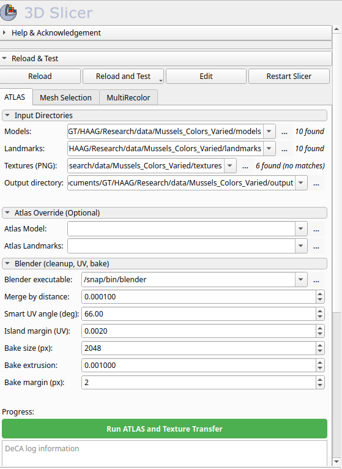

# InterDeCA: ATLAS Tab

## Overview

There are 3 main steps to run ATLAS and texture transfer:
1. **Model Import:** Select any of the 3D models to be used in generating the atlas and import it into Slicer.
2. **Hyperparameter Tuning:** Tune the UV mapping and texture baking parameters (if necessary).
3. **Run:** Click the `Run ATLAS and Texture Transfer` button.

## Model Import

This can be done in the `Welcome to Slicer` menu by clicking the `Add Data` button. After clicking, there will be a prompt to find and select data files to import from your file system. For running ATLAS and texture transfer, selecting any of the 3D model (.obj) files in your desired dataset will suffice.

## Hyperparameter Tuning

After importing one of your 3D models, open the InterDeCA module at the path `SlicerMorph -> DeCA Toolbox -> InterDeCA`. You'll see a menu like the one in the image below.



First, you'll need to enter the paths to the directories in your file system containing the desired models, landmarks, and textures. You'll also need to provide an output directory where all the produced files will be stored; we recommend using an empty directory so that the results from different runs don't get mixed up.

If you've already run ATLAS, you can enter in the paths to the generated atlas model and atlas landmarks. This is optional.

Under `Blender (cleanup, UV, bake)`, you'll see different hyperparameters. The first is the filepath to the blender executable on your system. If running on Linux, for guaranteed stability, we recommend pre-installing Blender using the command
```bash
sudo snap install blender --classic
```
and entering in the resultant filepath. For Windows and macOS users, InterDeCA will attempt to auto-install Blender if it isn't detected in your file system. 

The `Merge by distance` hyperparameter specifies the distance below which vertices are automatically merged; this cleans up duplicate/overlapping vertices before UV unwrapping.

The `Smart UV angle (deg)` hyperparameter specifies the maximum angle between faces that can be included in the same UV island; this controls how the 3D surface is "cut" and flattened into 2D UV space. 

The `Island margin (UV)` hyperparameter specifies the spacing between UV islands in the 0-1 UV space to prevent texture bleeding between different parts of the model. 

The `Bake size (px)` hyperparameter specifies the resolution of the output texture map (px by px). The higher this value, the more detailed the texture map, but the larger the file size.

The `Bake extrusion` hyperparameter specifies how far to "push out" the baked data from the surface in order to help capture details while preventing gaps in the texture.

The `Bake margin (px)` hyperparameter specifies the pixel padding around UV islands in the baked texture. This prevents edge artifacts and seams.

In some cases, resultant textures will have black speckles; we've found decreasing the `Merge by distance` value by a few orders of magnitude significantly helps. Otherwise, the default hyperparameter values (usually) work well.

## Run

Once all the necessary fields are filled-out and the hyperparameters are tuned, click the green `Run ATLAS and Texture Transfer` button at the bottom of the ATLAS tab menu. This will run atlas generation and texture transfer using the input sets of models, landmarks, and textures.