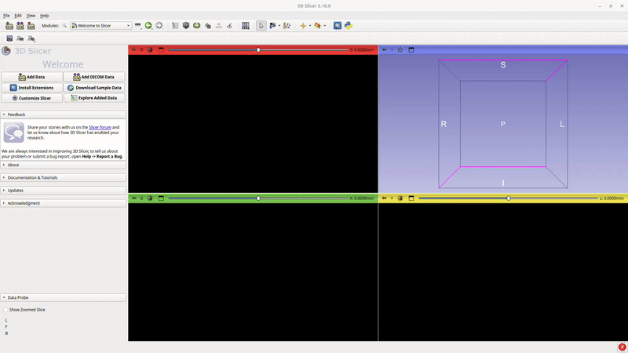
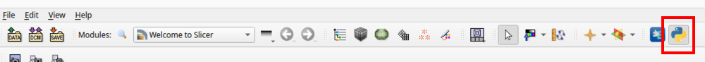

# InterDeCA: Installation

This installation covers how to download and install the **InterDeCA** tool. We assume you already have the 3D Slicer software downloaded and installed on your system (if you don't, find install options [here](https://download.slicer.org/)). 

## Downloading

### InterDeCA Module and ATLAS Dependency

Open your system's command-line terminal, and run the following command:
```bash
git clone --branch demo --recurse-submodules https://github.com/bshi42/3d_color_package.git
```
The GIF below depicts what this process should look like. Please note, you likely will not need to seen in to clone the repo after the software is published.


## Installing in 3D Slicer

### ATLAS 

You've already downloaded ATLAS as a submodule of InterDeCA. However, you will still need to install it in 3D Slicer separately. Following the instructions provided in the [ATLAS github repository](https://github.com/agporto/ATLAS), perform the following steps:
1. Add the cloned top-level `ATLAS` folder to Slicer using the dropdown menu: `Developer Tools -> Extension Wizard -> Select Extension -> Select ATLAS`
2. Open one of the ATLAS modules (BUILDER, DATABASE, PREDICT, or SEGMENTATION) to confirm it loaded correctly.

The GIF below demonstrates what this process should look like.



### InterDeCA

First, open the Python console in 3D Slicer and perform the following commands:

```python
>>> import slicer
>>> slicer.util.pip_install('imageio')
>>> slicer.util.pip_install('scikit-learn')
>>> slicer.util.pip_install('umap-learn')
>>> slicer.util.pip_install('scikit-image')
```



The image above shows where the Python console button is in the 3D Slicer UI (the console will open on the bottom right of the UI). Once this is done, restart the 3D Slicer app.

Next, perform the following steps in order:
1. Go to `Edit -> Application Settings -> Modules` in 3D Slicer.
2. Add the path to `color_deca/deca3` directory within the downloaded `3d_color_package` repository by dragging and dropping the `deca3` folder from your file system.
3. Restart 3D Slicer.

The GIF below shows how to perform steps 1 and 2.


### Blender (Optional)

InterDeCA also includes auto-detection and auto-install functionality for Blender, which we use for texture baking functionality. If it doesn't work on your system, Blender can be downloaded and installed manually following the resources [here](https://www.blender.org/download/).
