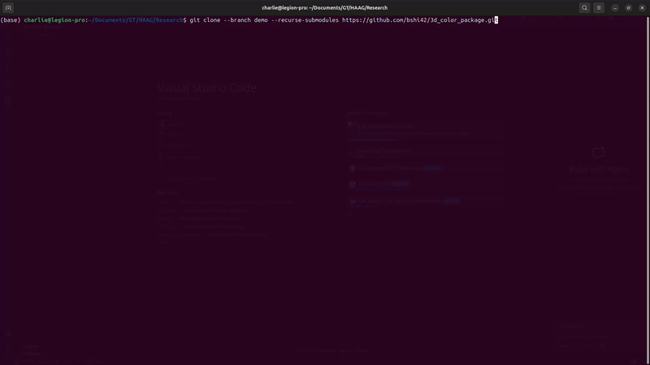
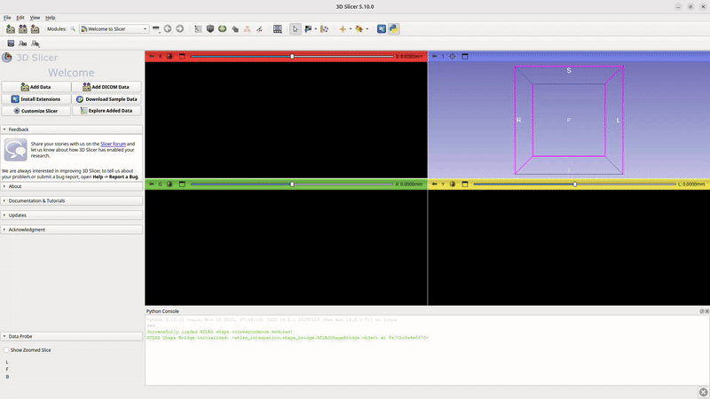
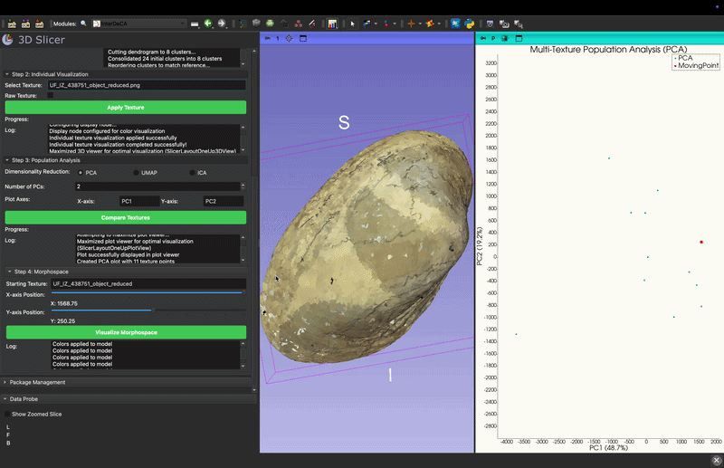

# 3D Color Package: End-to-End Workflow with InterDeCA

This tutorial guides you through the complete workflow of the **3D Color Package** (InterDeCA), from installation to analyzing color variation in a population. We will use a **10-mussel dataset** as our example.

## Prerequisites

- **3D Slicer**: Download and install from [download.slicer.org](https://download.slicer.org/).
- **Dataset**: The 10-mussel dataset is included in this repository under `Tutorials/data`.

---

## Part 1: Installation

### 1. Download the Repository
Open your terminal and clone the repository:
```bash
git clone --branch demo --recurse-submodules https://github.com/bshi42/3d_color_package.git
```


### 2. Install Dependencies in 3D Slicer
Open 3D Slicer, open the Python Console (Ctrl+3 or View -> Python Console), and run:
```python
import slicer
slicer.util.pip_install('imageio')
slicer.util.pip_install('scikit-learn')
slicer.util.pip_install('umap-learn')
slicer.util.pip_install('scikit-image')
```
*Restart 3D Slicer after installation.*

### 3. Install ATLAS
1. Go to `Developer Tools -> Extension Wizard -> Select Extension`.
2. Select the `ATLAS` folder within the cloned repository.
3. Verify that modules like `ATLAS_BUILDER` appear in the modules list.

### 4. Install InterDeCA
1. Go to `Edit -> Application Settings -> Modules`.
2. Add the path to `3d_color_package/color_deca/deca3`.
3. Restart 3D Slicer.




---

## Part 2: Generating an Atlas (ATLAS Tab)

The **ATLAS** module aligns all your 3D models to a common template (atlas) and transfers their textures to it, enabling pixel-wise comparison.

### 1. Open the Module
Go to `SlicerMorph -> DeCA Toolbox -> InterDeCA` and select the **ATLAS** tab.

### 2. Set Input Directories
Point the file selectors to the 10-mussel dataset included in the `Tutorials/data` directory:
- **Model Directory**: `.../3d_color_package/Tutorials/data/models`
- **Landmark Directory**: `.../3d_color_package/Tutorials/data/landmarks`
- **Texture Directory**: `.../3d_color_package/Tutorials/data/textures`

Ensure your files follow a consistent naming pattern (e.g., `UF_IZ_[ID]_object_reduced.*`).

### 3. Set Output Directory
Create and select an empty directory for output, e.g., `.../3d_color_package/Tutorials/data/output`.

### 4. Configure Parameters
- **Blender Executable**: Path to your Blender executable. (Linux users: `snap install blender --classic`).
- **Merge by distance**: Cleans up vertices (default usually fine).
- **Smart UV angle**: Controls UV island flattening.
- **Bake size (px)**: Resolution of the output maps (e.g., `1024` or `2048`).

### 5. Run
Click **Run ATLAS and Texture Transfer**. This process:
1. Generates a mean shape (Atlas).
2. Aligns all specimens to the Atlas.
3. Transfers textures from each specimen to the Atlas UV space.

---

## Part 3: Analyzing Color (MultiRecolor Tab)

The **MultiRecolor** tab allows you to analyze and visualize the color variation across your population using the aligned textures generated in Part 2. The workflow consists of 4 steps:

### Step 1: Multi-texture Clustering
This step processes all texture images to create a consistent, shared color palette for comparison.
1. **Model**: Select the generated Atlas model (from your output folder).
2. **Texture Directory**: Select the directory containing the *transferred* textures (usually in your output folder under `atlas_textures`).
3. **Mode**: Choose **Clustering** to create a shared palette.
4. **Parameters**:
   - `Initial Clusters`: 24 (higher for more detail).
   - `Consolidated Clusters`: 8 (number of final colors).
5. Click **Cluster**.

### Step 2: Individual Visualization
After clustering, it is crucial to visualize how the shared palette represents each individual specimen. This confirms that the color simplification (quantization) accurately captures the main patterns of the original specimen.

1. **Select Texture**: Choose a specific texture file from the dropdown list.
2. **Apply Texture**: Click to apply the clustered texture to the 3D model.
3. **Toggle Raw/Clustered**: You can compare the original (raw) texture vs. the clustered result to ensure the color details are preserved.
   - If the result looks "patchy" or misses key details, consider increasing the number of `Consolidated Clusters` in Step 1.

### Step 3: Population Analysis
This step performs dimensionality reduction to compare color patterns across all textures in a scatter plot.
1. **Method**: Select **PCA** (Principal Component Analysis).
2. **Number of PCs**: 2.
3. Click **Compare Textures**.
4. A scatter plot will appear. Each point represents one mussel specimen.
   - Points closer together have more similar color patterns.
   - Points farther apart are more distinct.


### Step 4: Morphospace
This step allows you to interactively explore the color variation by navigating through the simplified color space (PCA space).
1. Expand the **Morphospace** section.
2. Click **Visualize Morphospace**.
3. Use the **X-axis** and **Y-axis** sliders to explore color variations.
   - **Interactive Exploration**: As you move the sliders, the 3D model updates in real-time to show the *predicted* color pattern for that specific position in the PCA space.
   - You can visualize hypothetical transitions between different color morphs (e.g., seeing how a striped pattern might fade into a solid color).




