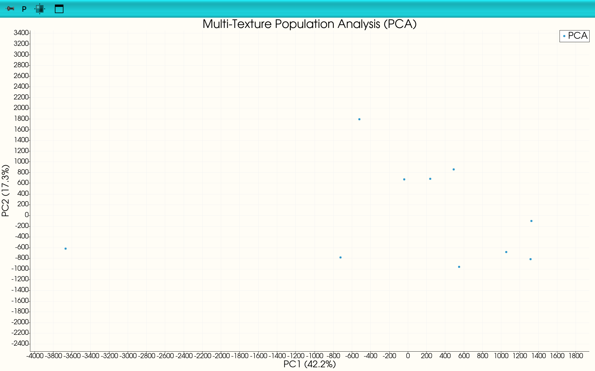
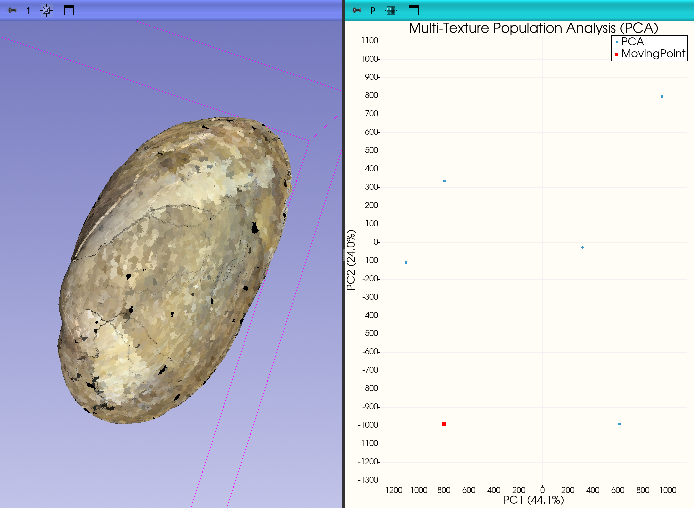
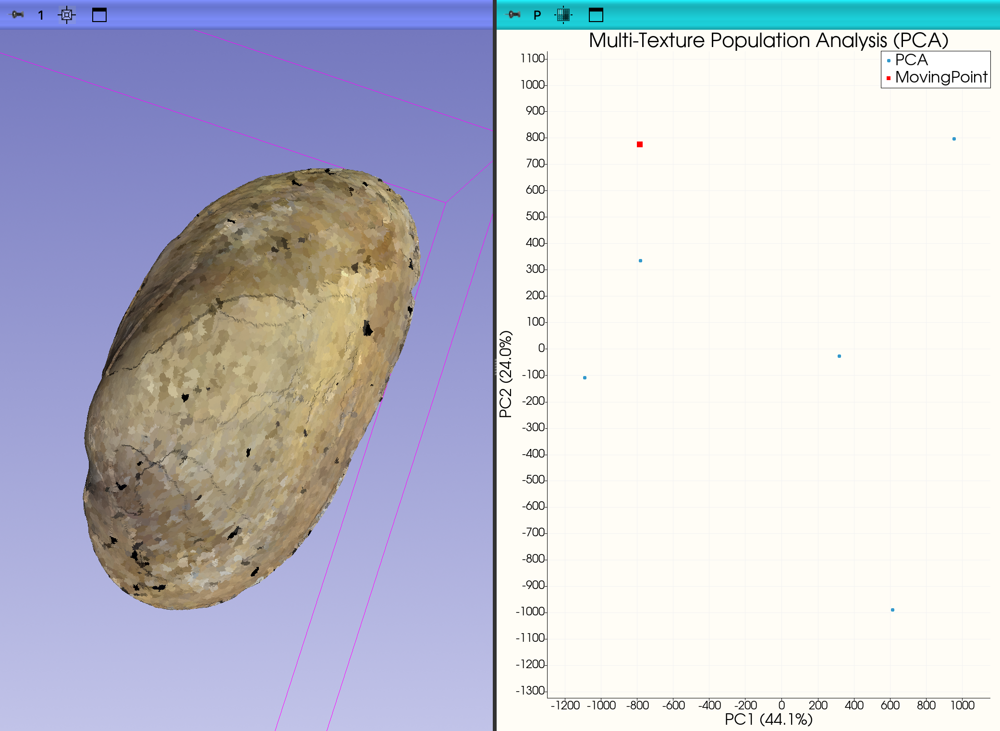

# InterDeCA: MultiRecolor Tab

This tutorial covers the **MultiRecolor** tab in InterDeCA, which allows you to perform comparative multi-texture color analysis across a population of specimens. This is useful for standardizing color palettes, comparing color patterns, performing dimensionality reduction (PCA, UMAP, ICA), and exploring color morphospace.

## Overview

The MultiRecolor tab provides a 4-step workflow:

1. **Step 1: Multi-Texture Clustering** - Process multiple textures to create a standardized color palette
2. **Step 2: Individual Visualization** - View individual textures with the shared color palette
3. **Step 3: Population Analysis** - Compare all textures using dimensionality reduction (PCA/UMAP/ICA)
4. **Step 4: Morphospace** - Interactively explore color variation in reduced-dimension space

---

## Step 1: Multi-Texture Clustering

This step processes all texture images in a directory to create a consistent, shared color palette for comparison.

### Setup

1. **Select Model**
   - Choose the atlas model from the **Model** dropdown. This should be the same model used when creating the textures.

2. **Select Texture Directory**
   - Click the **Texture Directory** field and navigate to the folder containing your texture images (.png, .jpg, .jpeg, .tiff, .bmp).
   - The log will display how many texture files were found.

### Choose a Mode

Select one of two processing modes:

- **Clustering** (default): Performs full color quantization with a shared palette across all textures. Best for standardized color comparison.
- **Subsample and Average Only**: Skips color quantization and uses raw averaged face colors. Useful when you want to preserve original color variation without clustering.

### Clustering Parameters (Clustering mode only)

- **Normalize Luminosity**: When checked, normalizes L* (lightness) and C* (chroma) across all textures to reduce lighting variation between specimens.

- **Initial Clusters**: Number of color clusters computed per texture (default: 24). Higher values capture more color detail but increase computation time.

- **Consolidated Clusters**: Final number of clusters after hierarchical merging (default: 8). Must be ≤ Initial Clusters. This determines how many distinct colors appear in the shared palette.

### Common Parameters

- **Number of Faces (Subsampling)**: Number of mesh faces to sample for clustering (default: 10,000). Faces are uniformly distributed across the surface. Higher values increase accuracy but also computation time.

- **Neighbor Average**: When checked, uses the average color of neighboring faces instead of individual face colors. This can reduce noise in the color data.

### Run Clustering

1. Click the **Cluster** button to start processing.
2. A progress bar will show the current status.
3. The log displays detailed information about each texture being processed.
4. When complete, the log will confirm how many textures were processed and how many clusters were created.

---

## Step 2: Individual Visualization

After clustering is complete, you can visualize individual textures with the standardized color palette applied.

1. **Select Texture**
   - Choose a texture from the **Select Texture** dropdown.

2. **Raw Texture** (optional)
   - Check this box to display the original texture without any processing (no face averaging or color quantization).

3. **Apply Texture**
   - Click the **Apply Texture** button to visualize the selected texture on the 3D model.
   - The 3D view will automatically maximize to show the result.

The visualization mode depends on your Step 1 settings:
- **Clustering mode**: Colors are quantized to the shared palette
- **Subsample-only mode**: Averaged face colors without quantization
- **Raw texture**: Original texture mapped directly

---

## Step 3: Population Analysis

This step performs dimensionality reduction to compare color patterns across all textures in a scatter plot.

### Dimensionality Reduction Method

Choose one of three methods:

- **PCA** (Principal Component Analysis): Linear method that finds directions of maximum variance. Good for identifying major color gradients. Axes represent interpretable color variation.

- **UMAP** (Uniform Manifold Approximation): Non-linear method that preserves local structure. Good for revealing clusters and non-linear relationships in color space.

- **ICA** (Independent Component Analysis): Linear method that finds statistically independent color components. Good for separating mixed color signals.

### Parameters

- **Number of PCs**: Number of components to compute (for PCA and ICA). Default is 2. Increase to capture more dimensions of color variation.

- **Plot Axes**: After running the analysis, use the **X-axis** and **Y-axis** dropdowns to select which components to display. This allows you to explore different dimensions of color variation.

### Run Analysis

1. Click the **Compare Textures** button.
2. The analysis will process all textures and create a scatter plot.
3. Each point in the plot represents one texture/specimen.
4. The plot is interactive - you can change the axes to view different component combinations.

*Figure 1: Population Analysis showing PCA results.*

---

## Step 4: Morphospace

This step allows you to interactively explore color variation by moving through the reduced-dimension space.

> **Note**: This section is collapsed by default. Click on "Step 4: Morphospace" to expand it.

### Setup

1. **Starting Texture**
   - Select a texture as your starting point in the morphospace. The sliders will be initialized to this texture's coordinates.

2. Click **Visualize Morphospace** to begin.

### Interactive Exploration

Once visualization starts:

1. **X-axis Position** and **Y-axis Position** sliders allow you to move through the morphospace.
   - The sliders span the full range of values observed in your population.
   - Moving a slider changes the corresponding coordinate in the reduced-dimension space.

2. The label below each slider shows the current coordinate value.

3. As you move the sliders:
   - The 3D model updates to show the predicted color pattern at that position
   - A moving point on the scatter plot shows your current location relative to the analyzed specimens

### Interpretation

- Moving along an axis shows how color patterns change along that dimension of variation.

*Y-axis Minimum Variation*

*Y-axis Maximum Variation*
- Positions near existing specimens will look similar to those specimens
- Positions between specimens show interpolated color patterns
- Extreme positions (beyond the range of observed specimens) extrapolate color patterns

---