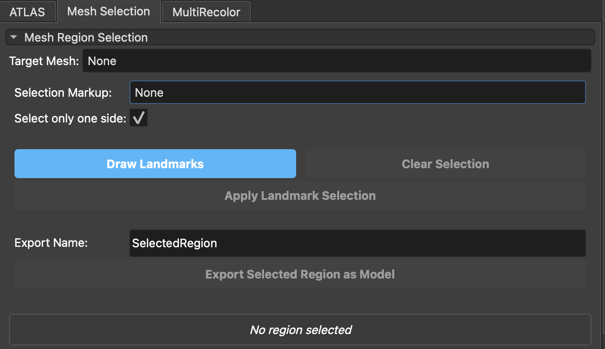
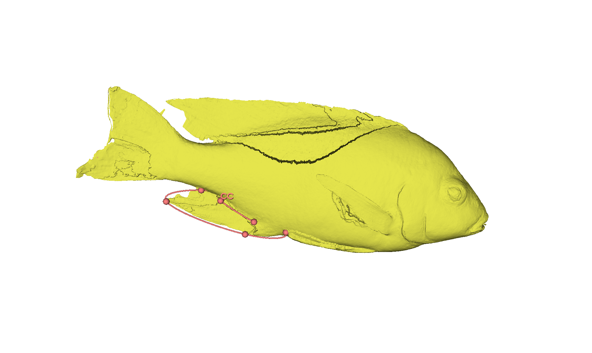
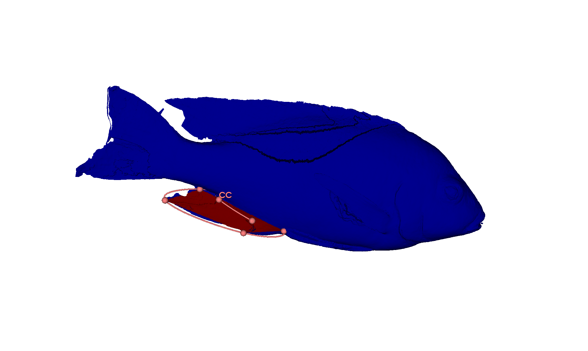

# InterDeCA: Segmentation (Mesh Region Selection)

This tutorial covers the **Mesh Region Selection** tab in InterDeCA, which allows you to interactively segment a Region of Interest (ROI) on an atlas model using landmark points or closed curves. This is useful for isolating specific biological structures or regions for analysis.

## Creating a Segmentation

1.  **Navigate to the Mesh Region Selection Tab**
    *   Click on the **Mesh Region Selection** tab in the InterDeCA module interface.

    

2.  **Select Target Mesh**
    *   In the **Target Mesh** dropdown, select the model you wish to segment.

3.  **Choose Selection Method**
    *   In the **Selection Markup** dropdown, select **Create new Closed Curve** (recommended) or **Create new Point List**.
        *   **Closed Curve**: Automatically connects the points with a line, making it easier to visualize the boundary of your region.
        *   **Point List**: Places individual points (fiducials). The region will be defined by the area enclosed by these points, but the boundary line won't be explicitly drawn.

4.  **Define the Region Boundary**
    *   Click the **Draw Landmarks** button.
    *   The cursor will change to a crosshair. Click on the surface of your atlas model to place points that define the boundary of your region.
        *   If no markup node is selected, InterDeCA will automatically create a new "SelectionCurve" (Closed Curve) for you.
        *   Continue placing points to trace the outline of the region you want to select.
    *   **Press ESC** on your keyboard when you are finished placing points to exit the drawing mode. The curve will automatically close.

    

    > **Note:** You can adjust the position of any point after drawing by clicking and dragging it on the 3D view.

5.  **Configure Selection Options**
    *   **Select only one side**:
        *   **Checked (Default)**: Restricts the selection to vertices that are on the "same side" as your landmarks. This is useful for selecting a patch on a closed surface without selecting vertices on the opposite side of the mesh (e.g., selecting the face of a skull without selecting the back of the head).
        *   **Unchecked**: Selects all vertices inside the boundary curve, potentially projecting through the mesh if the geometry is complex.

6.  **Apply Selection**
    *   Click the **Apply Landmark Selection** button.
    *   The selected region will be highlighted (typically in red) on the atlas model.
    *   The info box will update to show how many vertices were selected and the percentage of the total mesh.

    

7.  **Refine (Optional)**
    *   If the selection isn't quite right, you can move the landmark points and click **Apply Landmark Selection** again to update the result.
    *   To start over, click the **Clear Selection** button.

## Exporting the Segmented Region

Once you are satisfied with the selection, you can export it as a new, separate model.

8.  **Name the Region**
    *   Enter a name for the new model in the **Export Name** field (default is "SelectedRegion").

9.  **Export**
    *   Click **Export Selected Region as Model**.
    *   A new model node containing only the selected vertices and faces will be added to the scene. You can now save this model or use it for further analysis.
